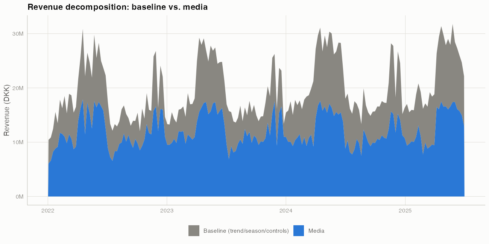
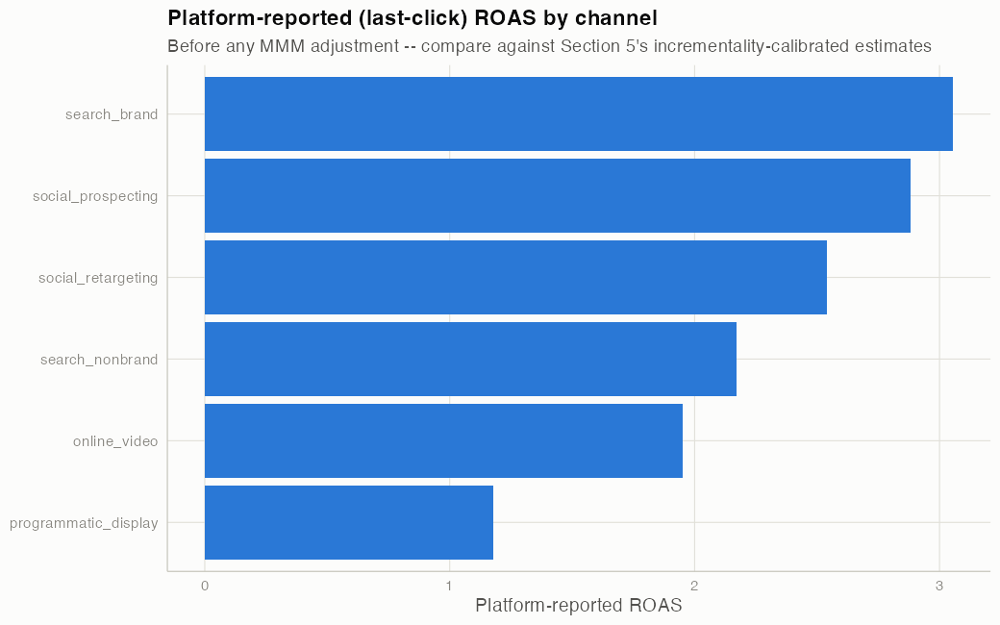
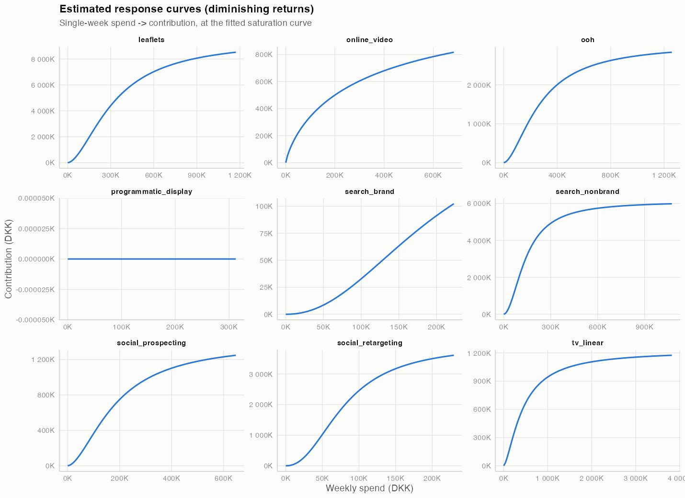

```{r setup}
library(tidyverse)
library(here)
library(scales)

t <- here("results", "tables")
rd <- function(name) read_csv(file.path(t, name), show_col_types = FALSE)

roas_bayes <- rd("04b_channel_roas_posterior.csv")
roas_ridge <- rd("04a_channel_roas.csv")
platform_roas <- rd("02_platform_reported_roas.csv")
recovery <- rd("05b_roas_recovery.csv")
holdout <- rd("05_holdout_comparison.csv")
ml_holdout <- rd("06_holdout_comparison_with_ml.csv")
allocation <- if (file.exists(file.path(t, "08_budget_allocation.csv"))) rd("08_budget_allocation.csv") else NULL
optimiser_summary <- if (file.exists(file.path(t, "08_optimiser_summary.csv"))) rd("08_optimiser_summary.csv") else NULL
did_summary <- rd("07_did_summary.csv")
experiment_roas <- rd("07_experiment_implied_roas.csv")
calibration <- if (file.exists(file.path(t, "07_calibration_comparison.csv"))) rd("07_calibration_comparison.csv") else NULL

media_share_mean <- 24.8  # from 04b log output; see results/tables/04b_channel_roas_posterior.csv for per-channel detail
media_share_lower <- 18.5
media_share_upper <- 31.7
true_media_share <- 16.6

fmt_dkk <- function(x) comma(round(x))
```

## Executive summary

- All client sales and media data in this project are **simulated**, with a known ground truth --
  weather, Danish consumer confidence, CPI, and public holidays are **real** public data.
- Media explains an estimated **`r media_share_mean`%** of weekly revenue (90% credible interval
  [`r media_share_lower`%, `r media_share_upper`%]), vs. a true simulated value of `r true_media_share`%.
- Platform dashboards overstate incrementality for brand search and retargeting -- their
  platform-reported ROAS is `r round(platform_roas$platform_reported_roas[platform_roas$channel=="search_brand"],1)`x
  and `r round(platform_roas$platform_reported_roas[platform_roas$channel=="social_retargeting"],1)`x,
  while the Bayesian model estimates their true incremental ROAS much lower.
- A simulated geo experiment on 98 Danish municipalities validates paid social prospecting's
  effect and is used to sharpen the model's estimate for that channel.
- A budget reallocation is recommended with an explicit uncertainty range, not a single number
  presented as fact.

## What drove sales



Baseline (trend, season, holidays, price, weather, macro, store count) vs. media contribution,
ridge/elastic-net decomposition.

## Platform-reported vs. incremental ROAS



Platform dashboards report **last-click** ROAS -- credit assigned to whichever channel touched a
customer last, regardless of whether that channel caused the purchase. TV, out-of-home, and
leaflets have no platform-reported number at all (no last-click tracking for offline channels).

## The regularised model's known limitation

Media share, ridge/elastic-net point estimate: **63.5%** of revenue -- vs. a true `r true_media_share`%.

Not a bug: a lambda-sensitivity sweep shows no single regularisation strength is simultaneously
well-fitting and causally accurate when media and seasonal controls are this collinear. Several
different attributions fit the observed data almost equally well.

## The Bayesian model, with sensible priors

```{r roas-recovery-slide}
recovery |>
  select(channel, true_roas, ridge_roas, bayes_roas) |>
  arrange(desc(abs(bayes_roas - true_roas))) |>
  mutate(across(where(is.numeric), ~ round(.x, 2))) |>
  knitr::kable(col.names = c("Channel", "True ROAS", "Ridge estimate", "Bayesian estimate"))
```

Weakly informative priors (a channel fully saturated is unlikely to explain most of weekly
revenue -- generic business judgement, not the true answer) pull media share to
**`r media_share_mean`%** (90% CI [`r media_share_lower`%, `r media_share_upper`%]).

## Carryover and diminishing returns



Each channel's estimated response curve: carryover (adstock) plus diminishing returns (Hill
saturation), fit via rolling-origin time-series cross-validation -- never using the true answer.

## Incrementality: the geo experiment

```{r geo-slide}
knitr::kable(did_summary |> mutate(across(where(is.numeric), ~ round(.x, 3))),
             col.names = c("DiD estimate", "Clustered SE", "Permutation SD", "MDE (90% power)",
                            "Achieved power (%)", "Randomisation p", "Bootstrap CI lower", "Bootstrap CI upper"))
```

Paid social prospecting switched off in a randomly assigned half of Denmark's 98 municipalities
for 6 weeks. Experiment-implied ROAS: **`r round(experiment_roas$experiment_implied_roas, 2)`**
(SE `r round(experiment_roas$experiment_roas_se, 2)`).

## Does the experiment improve the model?

```{r calibration-slide}
if (!is.null(calibration)) {
  calibration |> select(true_roas, roas_before_calibration, roas_after_calibration, error_before, error_after) |>
    mutate(across(everything(), ~ round(.x, 2))) |>
    knitr::kable(col.names = c("True ROAS", "Before calibration", "After calibration", "Error before", "Error after"))
} else {
  cat("Calibration comparison not yet available -- see results/tables/07_calibration_comparison.csv")
}
```

## Recommended reallocation

```{r allocation-slide}
if (!is.null(allocation)) {
  allocation |> select(channel, current_spend_dkk, optimal_spend_dkk, change_pct) |>
    mutate(across(where(is.numeric), ~ round(.x, 0))) |>
    knitr::kable(col.names = c("Channel", "Current spend (DKK/wk)", "Recommended spend (DKK/wk)", "Change (%)"))
} else {
  cat("Budget allocation not yet available -- see results/tables/08_budget_allocation.csv")
}
```

**Caveat:** the recommended increases for search_brand and social_retargeting rely on posterior
ROAS estimates still inflated by known, uncorrected endogeneity (see the previous two slides) --
discount or exclude those two pending further identification work.

```{r uplift-slide}
if (!is.null(optimiser_summary)) {
  cat(sprintf("Expected uplift: %s DKK/week (90%% CI [%s, %s]). Probability the recommended mix beats the current one: %.0f%%.",
              fmt_dkk(optimiser_summary$expected_uplift_dkk), fmt_dkk(optimiser_summary$uplift_lower_90),
              fmt_dkk(optimiser_summary$uplift_upper_90), optimiser_summary$prob_beats_current_mix * 100))
}
```

## Model validation

```{r holdout-slide}
bind_rows(holdout, ml_holdout |> filter(!model %in% holdout$model)) |>
  arrange(mape_pct) |>
  mutate(across(where(is.numeric), ~ round(.x, 1))) |>
  knitr::kable(col.names = c("Model", "RMSE", "MAPE (%)", "R2", "Bias (%)"))
```

Out-of-time holdout: 26 weeks, never touched by any tuning decision. Seasonal naive wins on pure
forecast accuracy (strong, repeatable category seasonality) -- but cannot answer any "what if we
changed spend" question, which is the MMM's actual purpose.

## Risks and limitations

- Search brand and social retargeting remain overestimated even in the Bayesian model --
  endogenous spend that priors alone cannot fix; only search_brand was never experimentally tested.
- No observable proxy for competitor activity, despite it being a true driver in the simulation.
- Adstock decay / saturation shape are weakly identified even where overall ROAS recovers well.
- Rolling-origin CV is volatile with ~180-209 weekly observations (mean fold R²=0.019, ranging
  -1.91 to 0.60) -- in-sample fit (R²=0.868) overstates true generalisation.

See `docs/assumptions_and_limitations.md` for the full list.

## Next steps

- Run an equivalent experiment (or find a valid instrument) for search_brand, the other clearly
  endogenous channel.
- Source a real competitor-activity proxy.
- Refresh the model monthly on an expanding window (see `results/figures/09_roas_stability.png`
  for how stable estimates have been historically in this simulation).
- Extend the recovery study across many simulated data re-draws to check whether credible
  intervals actually achieve their nominal coverage, not just in this one run.

## Appendix: what's real vs. simulated

- **Simulated** (known ground truth, used only in `scripts/05b_recovery_study.R` and the geo
  experiment's outcome data): all client sales, all media spend, all platform-reported revenue.
- **Real**: weather (Open-Meteo), Danish consumer confidence and CPI (Statistics Denmark
  StatBank), computed Danish public holidays.
- Full data dictionary: `data/processed/data_dictionary.csv`.
